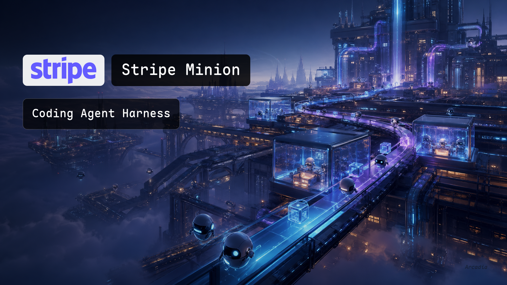
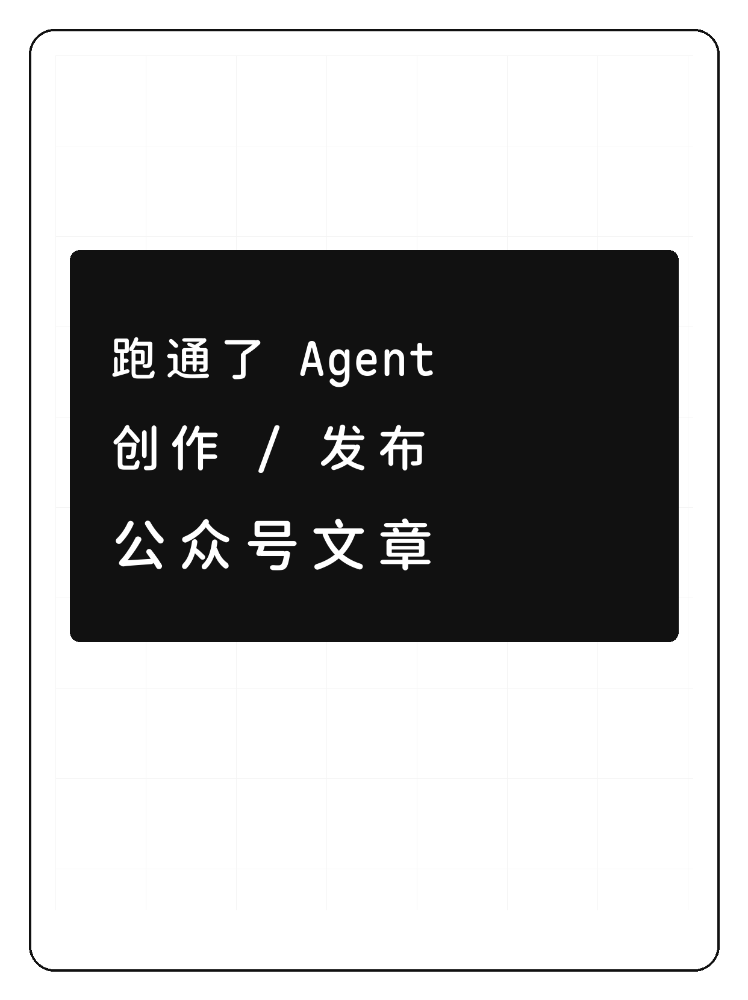
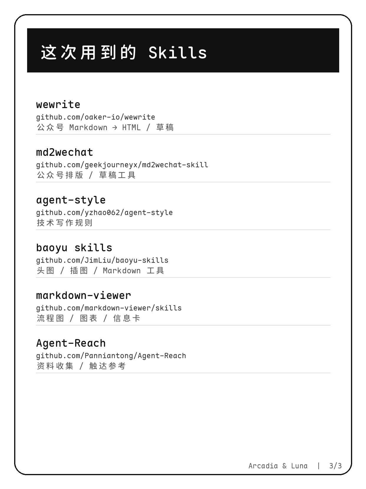

# Minimal Graph

A reusable OpenClaw/agent skill for creating strict minimal editorial visuals:

- WeChat article covers and infographics
- Xiaohongshu multi-page cards
- HTML/CSS/SVG deterministic visual assets
- Markdown Viewer diagram workflows
- Maple-font, phone-readable Chinese diagrams

The skill captures practical rules from repeated production of WeChat article visuals and Xiaohongshu social cards.


## Previews

### WeChat cover



### WeChat infographic


### Xiaohongshu card set

| Cover | Workflow | Skills |
|---|---|---|
|  |  |  |

## What this skill enforces

- Maple font for all visible text by default
- Minimal black-white editorial visual system
- WeChat cover safety: no white overlay, crop preview, no dense title text by default
- Xiaohongshu workflow: storyboard review → image review → publish confirmation
- HTML/CSS/SVG → PNG screenshot workflow
- Markdown Viewer → SVG → PNG workflow
- Public images should not expose private/local skills or credentials

## Files

```text
minimal-graph/
├── SKILL.md
├── SOURCES.md
├── assets/
└── references/
    ├── editorial-minimal-style.md
    ├── html-infographic-checklist.md
    ├── markdown-viewer-flowcharts.md
    ├── mermaid-normalization.md
    ├── wechat-article-workflow.md
    └── xhs-card-template.md
```

## Install

Copy this directory into your agent skills directory, for example:

```bash
cp -r minimal-graph ~/workspace/skills/
```

Then ask your agent to use `minimal-graph` when creating WeChat visuals, Xiaohongshu cards, or deterministic editorial infographics.

## License

MIT unless otherwise specified by bundled references. See `SOURCES.md` for provenance notes.
