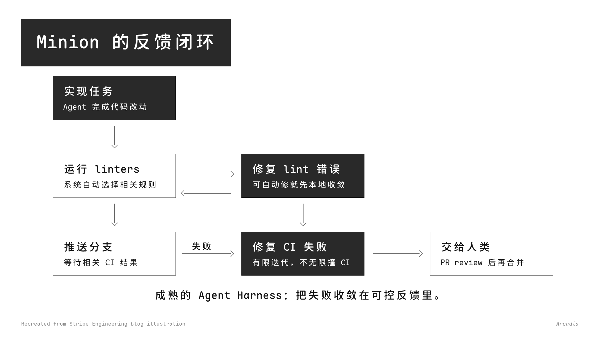

# Minimal Graph

一个用于生成极简信息图和流程图的 Agent Skill。

它只关注两条工程路径：

```text
HTML / CSS / SVG → PNG
Markdown Viewer / skills → SVG → PNG
```

## 预览

### 流程图示例 1



### 流程图示例 2


## 工程流程

### HTML / CSS / SVG → PNG

适合需要精确控制文字、布局、边框、箭头、图表和整体版式的图片。

流程：

1. 创建固定尺寸的 HTML 页面。
2. 用 `@font-face` 加载所需字体。
3. 用 HTML / CSS / SVG 写出图形结构。
4. 用浏览器截图生成 PNG。
5. 检查最终截图中的字体、裁切、重叠和可读性。

### Markdown Viewer / skills → SVG → PNG

适合先用图表语法生成结构，再统一转成图片。

流程：

1. 使用 Markdown Viewer 或相关 skill 生成图表结构。
2. 保存结构源文件，例如 `.dot`、`.puml`、`.mmd`、`.svg`。
3. 先渲染为 SVG。
4. 用矢量渲染器转换成 PNG。
5. 如果原生样式不符合要求，就把 SVG 当布局参考，用 HTML / SVG 重新绘制。

常用转换工具：

- `rsvg-convert`
- Chromium screenshot
- CairoSVG
- ImageMagick

## 文件结构

```text
minimal-graph/
├── SKILL.md
├── SOURCES.md
├── assets/
│   └── previews/
└── references/
    ├── editorial-minimal-style.md
    ├── html-infographic-checklist.md
    ├── markdown-viewer-flowcharts.md
    └── mermaid-normalization.md
```

## 安装

### 方式一：手动安装

使用 `npx` 从 GitHub 安装：

```bash
npx @openclaw/clawhub install github:Arcadia822/minimal-graph
```

如果你的环境没有配置 ClawHub，也可以直接 clone 到 skills 目录：

```bash
git clone https://github.com/Arcadia822/minimal-graph.git ~/workspace/skills/minimal-graph
```

### 方式二：让 agent 安装

对支持安装 skill 的 agent 说：

```text
请安装这个 skill：https://github.com/Arcadia822/minimal-graph
```

安装完成后，让 agent 在需要生成极简信息图或流程图时使用 `minimal-graph`。

## 许可证

MIT。来源和变更记录见 `SOURCES.md`。
