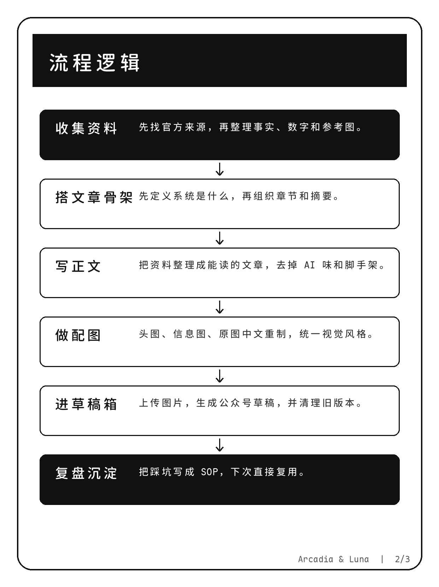

# Minimal Graph

一个用于生成极简信息图和流程图的 Agent Skill。

它关注的是一套可复用的视觉生产方法：

- 用清晰结构表达复杂流程
- 用稳定的 HTML / CSS / SVG 产出图片
- 用 Markdown Viewer 语法生成图表结构
- 用 Maple 字体保证中文图的可读性和一致性
- 在生成图片前后设置审阅关卡，避免直接把半成品发出去

## 预览

### 信息图流程图


### 社交卡片流程图



## 设计原则

- 信息优先，装饰克制。
- 结构比配色重要。
- 手机可读性优先于信息密度。
- 所有可控文字默认使用 Maple font。
- 图中文字必须由确定性排版生成，不依赖图片模型生成中文。
- 公开图中不要暴露私有路径、凭证、内部工具名或草稿 ID。

## 工作流

### 1. 先确定内容结构

在制图前先确认：

- 这张图要说明什么？
- 读者应该按什么顺序读？
- 哪些信息必须出现，哪些可以删掉？
- 是否需要先给用户审文字分镜？

### 2. 再选择图结构

可选方式：

- HTML / CSS / SVG：适合精确控制排版、中文文字、卡片和信息图。
- Markdown Viewer：适合作为流程图、Graphviz、UML、BPMN、Vega 等结构源。
- 生成式图片：只适合作为背景或插画资产，不负责最终文字。

### 3. 渲染成图片

推荐路径：

```text
HTML / CSS / SVG → 浏览器截图 → PNG
Markdown Viewer 语法 → SVG → PNG
```

最终检查截图，而不是只检查源码。

### 4. 交付审阅

如果用户要看图，就必须通过消息直接发送图片附件。  
本地路径、文件生成成功、口头描述都不算交付。

## 工程实现

### HTML / CSS / SVG → PNG

1. 创建固定尺寸页面。
2. 用 `@font-face` 加载 Maple 字体。
3. 用 HTML / CSS / SVG 控制文字、边框、箭头、图表和布局。
4. 使用浏览器截图生成 PNG。
5. 检查截图中的字体、裁切、重叠和可读性。

### Markdown Viewer → SVG → PNG

1. 使用 Markdown Viewer 语法描述结构。
2. 保存结构源文件，例如 `.dot`、`.puml`、`.mmd`。
3. 渲染为 SVG。
4. 用真实矢量渲染器转换成 PNG。
5. 如果原生样式不符合要求，就把 SVG 当布局参考，重新用 HTML / SVG 绘制。

优先转换工具：

- `rsvg-convert`
- Chromium screenshot
- CairoSVG
- ImageMagick

## 文件结构

```text
minimal-graph/
├── SKILL.md
├── SOURCES.md
├── assets/
│   └── previews/
└── references/
    ├── editorial-minimal-style.md
    ├── html-infographic-checklist.md
    ├── markdown-viewer-flowcharts.md
    ├── mermaid-normalization.md
    ├── wechat-article-workflow.md
    └── xhs-card-template.md
```

## 安装

复制到你的 agent skills 目录：

```bash
cp -r minimal-graph ~/workspace/skills/
```

之后在需要制作极简信息图、流程图、卡片图或技术图时，让 agent 使用 `minimal-graph`。

## 许可证

MIT。来源和变更记录见 `SOURCES.md`。
