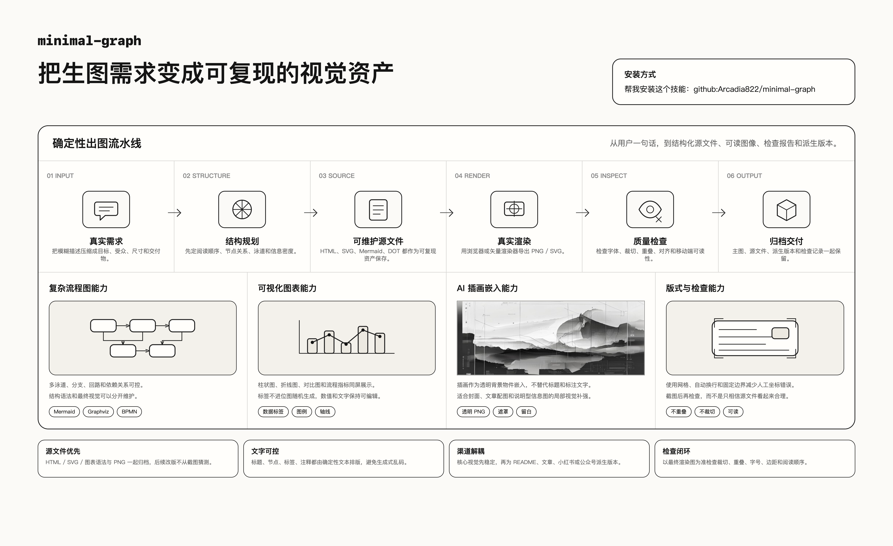

# minimal-graph

> 极简、确定性、可复用的图像 / 信息图 / 流程图生成逻辑。

`minimal-graph` 是一个面向 agent 的过程文档型 skill。它只负责**出图本身**：图形结构、版式、字体与可读性、渲染检查，以及源文件和输出文件的组织方式。
它**不**把某个平台的发布 SOP、文案套路、投放动作硬编码进核心 skill。

## 安装

### 推荐：让 agent 自动安装

把下面这句话交给支持 skill 安装的 agent：

```text
请安装并加载这个 skill：https://github.com/Arcadia822/minimal-graph
```

安装后，在出图任务里直接要求 agent 使用 `minimal-graph`，并产出源文件、主图和检查结果。

### 命令安装

```bash
npx @openclaw/clawhub install github:Arcadia822/minimal-graph
```

## 使用案例

```text
帮我做一张 16:9 中文流程图，解释“AI 文章配图从需求到发布”的完整流程。
要求：极简风格，移动端能看清，保留 HTML/SVG 源文件，导出 PNG，并检查有没有文字重叠或裁切。
```

```text
把“RAG 系统的检索、重排、生成、评估链路”做成一张适合 README 顶部展示的信息图。
要求：有节点、箭头、图标和简短说明，不要随机生成不可编辑文字，最后给我 PNG 和源文件。
```

## 这个 skill 解决什么问题

- 需要一张**结构清楚、文字可控、可复现**的视觉资产，而不是一次性的“看起来差不多”图片。
- 需要把信息图、流程图、卡片图、封面图做成**可继续维护**的 HTML / SVG / 源语法文件，而不只是最终 PNG。
- 需要在核心视觉稳定之后，再按渠道生成**派生版本**，但又不想让 xhs / wx 之类的平台细节污染主逻辑。

## 核心定位

| 负责 | 不负责 |
|---|---|
| 图形结构、阅读顺序、布局层级 | 平台发布流程 |
| 文字可读性、字体一致性、裁切检查 | 平台文案模板 |
| HTML / CSS / SVG 或图表语法的确定性渲染 | 上传、发布、运营动作 |
| 源文件与输出文件归档 | 把渠道约束写死进核心规则 |

## 任务入口怎么选

| 你要做的事 | 先读什么 |
|---|---|
| 任意确定性视觉资产 | [`SKILL.md`](./SKILL.md) |
| 极简版式、中文信息层级、文字风格 | [`references/editorial-minimal-style.md`](./references/editorial-minimal-style.md) |
| HTML 信息图落版与检查 | [`references/html-infographic-checklist.md`](./references/html-infographic-checklist.md) |
| Markdown Viewer / Graphviz / UML / BPMN 流程图 | [`references/markdown-viewer-flowcharts.md`](./references/markdown-viewer-flowcharts.md) |
| Mermaid 结构整理与规范化 | [`references/mermaid-normalization.md`](./references/mermaid-normalization.md) |
| 渠道外挂设计与调用边界 | [`references/channel-addons.md`](./references/channel-addons.md) |

## 两条核心工程路径

### 1. HTML / CSS / SVG -> PNG

适合需要精确控制以下要素的视觉资产：

- 标题和正文文字
- 布局网格
- 边框、箭头、标签
- 数据图形或信息块层级

基本路径：

1. 创建固定视口的 HTML 页面。
2. 用 `@font-face` 加载字体。
3. 用 HTML / CSS / SVG 明确写出结构和文字。
4. 渲染并截图为 PNG。
5. 检查字体、裁切、重叠、对齐与移动端可读性。

### 2. Markdown Viewer / 图表语法 -> SVG -> PNG

适合先用语法描述结构，再进行统一渲染：

- Graphviz DOT
- Mermaid
- PlantUML / BPMN / UML
- 其他可稳定导出 SVG 的图表语法

基本路径：

1. 先保存结构源文件，例如 `.dot`、`.mmd`、`.puml`。
2. 优先渲染为 SVG。
3. 再用真实矢量渲染器导出 PNG。
4. 如果默认样式不满足最小化可读性要求，就把 SVG 当布局参考重绘。

常见导出工具：

- `rsvg-convert`
- Chromium screenshot
- CairoSVG
- ImageMagick

## 渠道外挂模块

核心 skill 不直接内嵌 xhs / wx 等渠道逻辑。
如果某个输出需要渠道化派生版本，使用 `references/channel-addons/` 下的外挂模块。

当前已提供：

| Channel | 说明 | 文件 |
|---|---|---|
| `xhs` | 面向小红书浏览场景的派生打包约束 | [`references/channel-addons/xhs.md`](./references/channel-addons/xhs.md) |
| `wx-official-account` | 面向微信公众号文章封面 / 文章配图的派生打包约束 | [`references/channel-addons/wx-official-account.md`](./references/channel-addons/wx-official-account.md) |

调用方式：

1. 先完成**渠道无关**的核心视觉。
2. 再选择一个 channel addon。
3. 把 addon 的 `prompt_addon` 叠加到核心要求之后。
4. 仅在核心渲染通过检查后，才触发该渠道的 `posthook` 做派生打包。

## 输出组织

推荐把每组视觉资产组织成“源文件 + 主输出 + 渠道派生”的结构：

```text
<project>/
├── page.html / diagram.dot / diagram.svg
├── output.png
├── outputs/
│   └── <variant>.png
└── channels/
    └── <channel>/
```

这样做的目的不是“多存几份文件”，而是保证：

- 核心视觉可复现
- 渠道派生不覆盖主输出
- 后续改版能回到源文件继续演进

## 仓库结构

```text
minimal-graph/
├── README.md
├── SKILL.md
├── SOURCES.md
├── assets/
│   ├── previews/
│   │   ├── minimal-graph-overview.png
│   │   └── minimal-graph-overview.html
│   └── template.html
├── illustrations/
│   └── minimal-graph-overview/
│       ├── outline.md
│       ├── prompts/
│       └── 01-ai-illustration-panel.png
└── references/
    ├── channel-addons.md
    ├── channel-addons/
    ├── editorial-minimal-style.md
    ├── html-infographic-checklist.md
    ├── markdown-viewer-flowcharts.md
    └── mermaid-normalization.md
```

## 设计说明与来源

- 核心 skill 的职责边界见 [`SKILL.md`](./SKILL.md)。
- 设计来源与改写依据见 [`SOURCES.md`](./SOURCES.md)。

## 许可证

MIT。
